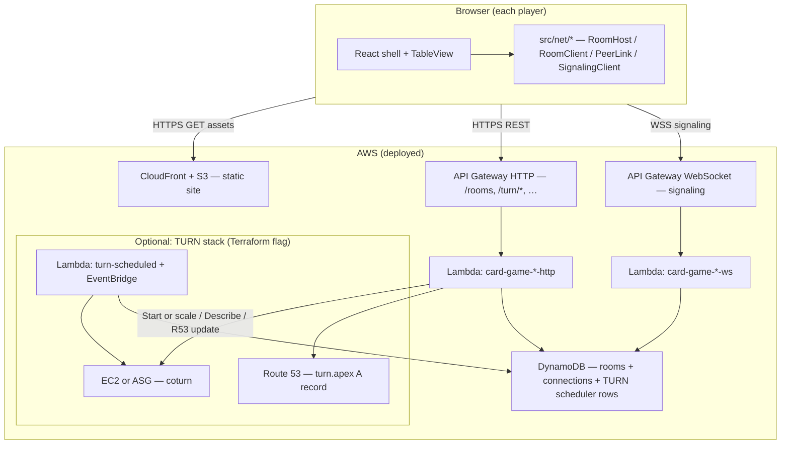
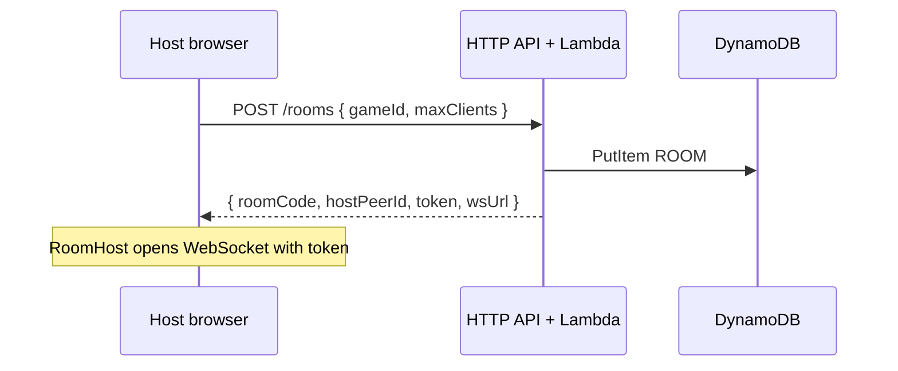
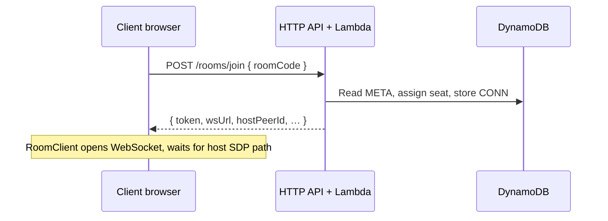
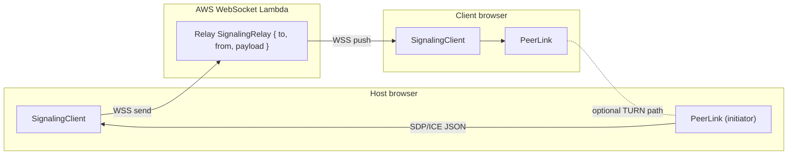
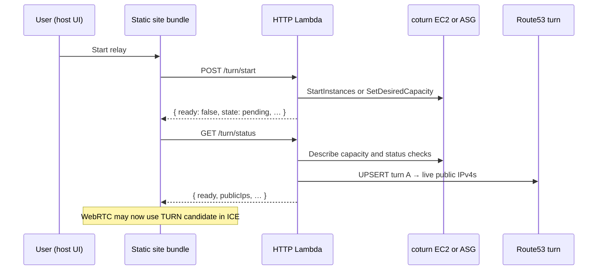

# Architecture — card-game

This document explains how the **browser app**, **AWS multiplayer stack**, **WebRTC peer-to-peer game channel**, **signaling relay**, and **optional TURN relay** fit together. It is a narrative map; implementation details live in code and in **[`AGENTS.md`](../AGENTS.md)**.

**Infrastructure and deploy** (Terraform inputs/outputs, S3/CloudFront, API Gateway, Lambdas, DynamoDB, optional coturn EC2) are documented in:

- **[`deploy/terraform/aws/README.md`](../deploy/terraform/aws/README.md)** — treat that file as the **deployment reference** for this doc.

Other useful links:

- **[`docs/games/`](games/)** — longer per-game notes (companion to **`src/rules/`**).
- **[`docs/ui-design.md`](ui-design.md)** — shell + multiplayer strip UI.
- **[`docs/multiplayer-chat.md`](multiplayer-chat.md)** — room chat over the data channel + popout.

---

## 1. Big picture (what runs where)

- **Game logic** (rules, table state) stays **in the browser** — there is no game server process in AWS.
- **AWS** provides **room metadata**, **short-lived JWTs**, **WebSocket signaling relay**, and **optional coturn** for strict NATs.

---

## 2. Planes of traffic (three different channels)

| Plane | Technology | Purpose |
|--------|------------|---------|
| **A. Signaling** | `wss://…` WebSocket to API Gateway → **WebSocket Lambda** | Carry **non-game** control: hello, roster, **SDP offers/answers**, **ICE candidates** between peers. Server **relays** opaque JSON; it does not parse WebRTC. |
| **B. Game data** | **WebRTC `RTCDataChannel`** (P2P between host and each client) | **Authoritative table snapshots** (host → clients), **intents** (client → host), optional **room chat**. This is the actual **multiplayer game** path. |
| **C. TURN / STUN (optional)** | `RTCPeerConnection` ICE (`src/net/config.ts`) | **NAT traversal** for plane B. **STUN** discovers public reflexive candidates; **TURN** relays media when direct UDP fails. Configured at **build time** via `VITE_*` (see deploy README). |

Planes **A** and **B** are independent: signaling can be “up” while the data channel is still **connecting** until ICE completes.

---

## 3. Multiplayer lifecycle (high level)

### 3.1 Host creates a room

- **`createRoom`** (`src/net/api.ts`) → **`RoomHost`** (`src/net/host.ts`) uses returned **`wsUrl`** and **`token`**.
- JWT proves the caller is the **host** for that `roomCode` (see `lambda/src/auth.ts`).

### 3.2 Client joins

- **`RoomClient`** (`src/net/client.ts`) connects signaling and participates in WebRTC as **non-initiator** (host creates the data channel).

### 3.3 WebRTC: signaling relay vs P2P data

1. **`PeerLink`** (`src/net/peer.ts`) creates **`RTCPeerConnection`** with **`iceServers`** from **`getMultiplayerConfig()`** (STUN + optional TURN).
2. ICE candidates and SDP are wrapped as app messages and sent via **`SignalingClient`** (`src/net/signaling.ts`) over the **WebSocket**.
3. The **WebSocket Lambda** (`lambda/src/websocket.ts`) looks up the target connection in **DynamoDB** and uses **API Gateway Management API** `PostToConnection` to deliver the envelope — that is the **“signaling relay”**.
4. Once ICE + DTLS succeed, **`RTCDataChannel`** is **peer-to-peer** (host ↔ each client). **Game state** does not flow through Lambda.

### 3.4 Tab refresh, persistence, and host signaling reconnect

The **shell** persists **selected game**, **AI preferences**, optional **solo table snapshots**, and **multiplayer room tokens + snapshots** in **`localStorage`** (`src/data/sessionPersistence.ts`). After a **solo** refresh, the UI offers **resume or discard**. **Host** and **client** can **auto-rejoin** the same room while the room JWT is still valid.

When the **host’s signaling connection** disconnects (for example the host refreshes the page), the WebSocket Lambda notifies clients with **`host-disconnected`** (including a grace interval in milliseconds) instead of immediately emitting **`peer-left`** for the host. Clients **keep the signaling WebSocket**, tear down the **DataChannel**, and open a new WebRTC session when the Lambda broadcasts **`host-rejoined`** after the host’s next `hello`. Optional Lambda env **`HOST_DISCONNECT_GRACE_MS`** defaults to **60000** (clamped between **5000** and **120000**). **`RoomHost`** keeps a **`peerId` → seat** map so a refreshed client reclaims the same seat. Bump **`PROTOCOL_VERSION`** in `src/net/protocol.ts` when changing signaling wire types, and deploy **site + WebSocket Lambda** together.

**Why Management API endpoint matters:** `PostToConnection` must target the **execute-api** URL for the WebSocket API (see comment in `lambda/src/websocket.ts`). Custom domains for clients are fine; the **server-side** post URL is special — details in **[`deploy/terraform/aws/README.md`](../deploy/terraform/aws/README.md)**.

---

## 4. Optional TURN / coturn (when enabled in Terraform)

When **`turn_ec2_enabled`** + Route 53 + GitHub flags/secrets are set (see deploy README):

- **`GET /turn/status`** — cheap poll for “is instance running / DNS aligned / checks OK”.
- **`POST /turn/heartbeat`** — usage signal for scheduled idle-stop (Dynamo scheduler).
- **`turn-scheduled` Lambda** — periodic **DescribeInstances** / ASG checks / optional **StopInstances** or ASG scale-down (see `lambda/src/turnScheduled.ts`, `turn.tf`).
- Terraform leaves **`turn.<domain>`** at **`127.0.0.1`** until the HTTP/status path updates it. In ASG mode the record can contain multiple live relay public IPv4s — see deploy README.
- **Packer AMI flow** — `packer/relay-coturn.pkr.hcl` pre-installs coturn. PR builds use PR-scoped AMIs only; `main` builds promote the AMI id to `TF_TURN_AMI_ID`.

---

## 5. Lambdas (what each is for)

| Lambda | Trigger | Role |
|--------|---------|------|
| **`…-http`** | API Gateway HTTP routes | **Rooms** (`/rooms`, `/join`), **TURN control** (`/turn/*`), **idle abandon** (`/rooms/abandon-idle`), JWT mint/verify helpers. |
| **`…-ws`** | API Gateway WebSocket `$connect`, `$default`, `$disconnect` | **Signaling relay** only: `hello`, roster, **`SignalingRelay`** forwarding between `connectionId`s stored in DynamoDB. |
| **`turn-scheduled`** (optional) | EventBridge rate | **EC2 lifecycle** for coturn when idle / backoff (no browser traffic). |

DynamoDB is a **single table** for room meta, WebSocket connection rows, reverse index for disconnect, and TURN scheduler aggregates — see **`lambda/src/storage.ts`**.

---

## 6. Shell integration (where this meets the table)

- **`src/ui/MultiplayerPanel.tsx`** — host/join UI, signaling + peer status, optional **Start relay**, idle modal, JWT for heartbeats.
- **`src/App.tsx`** — wires **`RoomHost`** / **`RoomClient`** to **`GameSession`**: host applies intents, broadcasts snapshots.
- **Online multiplayer** is **host-authoritative**: clients never mutate table state directly; they send **intents** over the data channel.

---

## 7. CI / deploy (reference only)

- **CI** — lint, tests, site build, lambda bundle (see `.github/workflows/ci.yml`).
- **Deploy** — Terraform apply → build site with baked `VITE_*` → S3 sync → CloudFront invalidation (see `.github/workflows/deploy.yml`).
- **PR previews** — same AWS stack shape with per-PR Terraform state, preview DNS (`pr-<n>`, `api-pr-<n>`, `ws-pr-<n>`, optional `turn-pr-<n>`), isolated PR AMIs when Packer changes, and automatic `terraform destroy` on PR close (see `.github/workflows/preview.yml`).
- **Relay perf** — manually deploys a separate `perf-pr-<n>` stack, runs TURN allocation/throughput checks, and comments results back on the PR (see `.github/workflows/relay-perf.yml`).

For **variables, secrets, custom domains, TURN secrets, and outputs**, use:

- **[`deploy/terraform/aws/README.md`](../deploy/terraform/aws/README.md)**

---

## 8. Further reading

| Topic | Location |
|--------|----------|
| Per-game modules, `GameModule`, AI | [`AGENTS.md`](../AGENTS.md) |
| Per-game repo notes (markdown) | [`docs/games/`](games/) |
| Room chat UX + protocol | [`docs/multiplayer-chat.md`](multiplayer-chat.md) |
| Wire protocol types | `src/net/protocol.ts` |
| Terraform resource list | [`deploy/terraform/aws/README.md`](../deploy/terraform/aws/README.md) |
